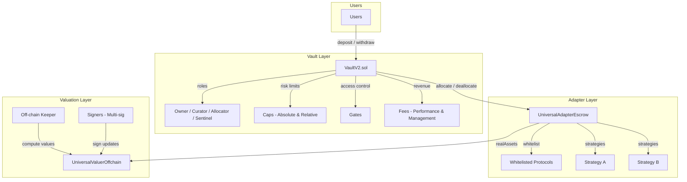
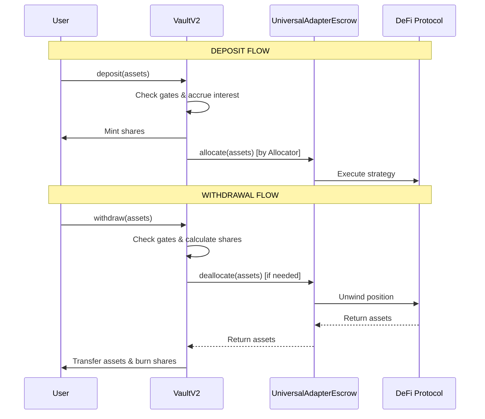
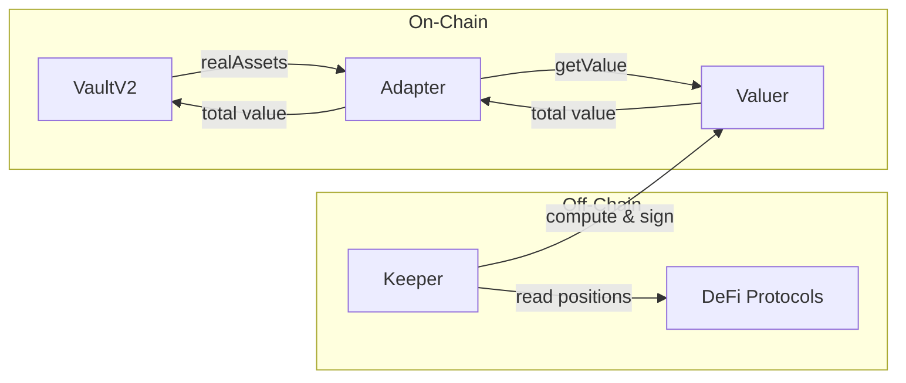
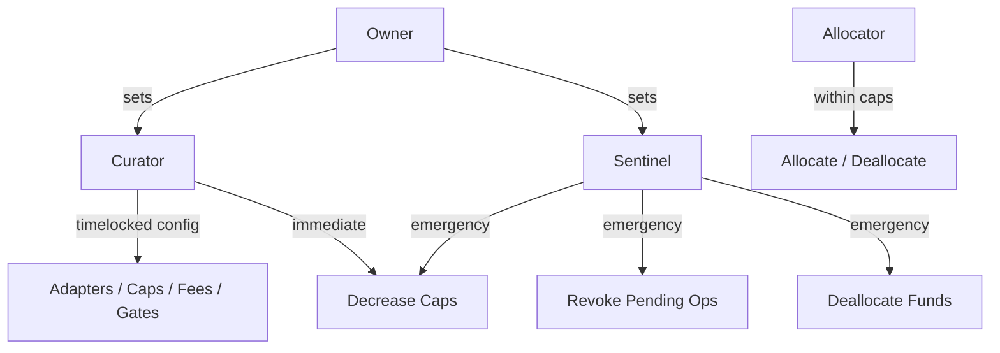

# Neko Vault V2

A non-custodial, ERC-4626 compliant vault system for multi-protocol DeFi allocation.

| Attribute | Details |
|-----------|---------|
| Standard | ERC-4626 + ERC-2612 |
| Architecture | Immutable (no upgrades) |
| Security | 5 independent audits, 121+ tests |
| Chain | HyperEVM (Chain ID: 999) |

---

## Architecture Overview



The system operates in three layers:

1. **Vault Layer** - User-facing ERC-4626 vault with role-based access control, risk caps, and fee mechanisms
2. **Adapter Layer** - Strategy execution with whitelist-based security and multi-protocol support
3. **Valuation Layer** - Off-chain oracle with cryptographic signature verification for accurate pricing

---

## How It Works

### Deposit & Withdrawal Flow



### Price Per Share (PPS) Calculation

```
PPS = totalAssets / totalSupply
```



The keeper continuously:
1. Reads on-chain positions (collateral, debt, idle assets)
2. Converts all positions back to deposit asset
3. Signs the valuation with authorized keys
4. Pushes signed reports to the valuer contract

---

## Trust Model

### Role Hierarchy



| Role | Centralization | Capabilities | Risk Mitigation |
|------|----------------|--------------|-----------------|
| **Owner** | Single address | Sets curator, sentinels, vault naming | Trust required |
| **Curator** | Single address | All configuration | Timelocked (users can exit) |
| **Allocator(s)** | Multiple allowed | Move funds within caps | Cap constraints |
| **Sentinel(s)** | Multiple allowed | Emergency derisk only | Limited to defensive |

### External Dependencies

| Component | Role | Failure Impact |
|-----------|------|----------------|
| **Off-chain Keeper** | Computes strategy valuations | 5% haircut if stale >24h |
| **Signers** | Multi-sig valuation approval (95% threshold) | Cannot update values if compromised |
| **Adapters** | Execute DeFi strategies | Fund loss if incorrectly implemented |

---

## Contracts to Review

| Contract | Purpose |
|----------|---------|
| [VaultV2.sol](./src/VaultV2.sol) | Main vault: deposits, withdrawals, roles, timelocks, fees |
| [UniversalAdapterEscrow.sol](./src/UniversalAdapterEscrow.sol) | Strategy execution: allocation, whitelist multicall |
| [UniversalValuerOffchain.sol](./src/UniversalValuerOffchain.sol) | Valuation oracle: multi-sig price updates |
| [VaultV2Factory.sol](./src/VaultV2Factory.sol) | Vault deployment |

---

## Non-Custodial Guarantees

Users are protected by three mechanisms:

### 1. In-Kind Redemptions
Anyone can call `forceDeallocate()` to exit positions, even if the allocator is unresponsive. A penalty (0-2%) disincentivizes manipulation.

### 2. Timelocked Configuration
Critical curator operations require a time delay. Users can monitor pending changes and exit before they take effect.

### 3. Immutable Contracts
No proxy patterns or upgrade mechanisms. The deployed code cannot be changed, eliminating "rug via upgrade" risk.

---

## Security Audits

| Module | Auditor | Location |
|--------|---------|----------|
| Vault V2 | Chainsecurity, Blackthorn, Zellic | [audits/morpho-vault-v2/](./audits/morpho-vault-v2/) |
| Universal Adapter | SBSecurity, Octane | [audits/universal-adapter/](./audits/universal-adapter/) |

---

## Documentation

| Document | Description |
|----------|-------------|
| [VAULT_V2_ARCHITECTURE.md](./docs/VAULT_V2_ARCHITECTURE.md) | Complete technical specification |
| [UNIVERSAL_ADAPTER.md](./docs/UNIVERSAL_ADAPTER.md) | Adapter system documentation |
| [UNIVERSAL_VALUER_OFFCHAIN.md](./docs/UNIVERSAL_VALUER_OFFCHAIN.md) | Valuation oracle specification |
| [PPS_CALCULATION.md](./docs/PPS_CALCULATION.md) | Price per share calculation |
